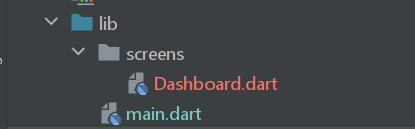
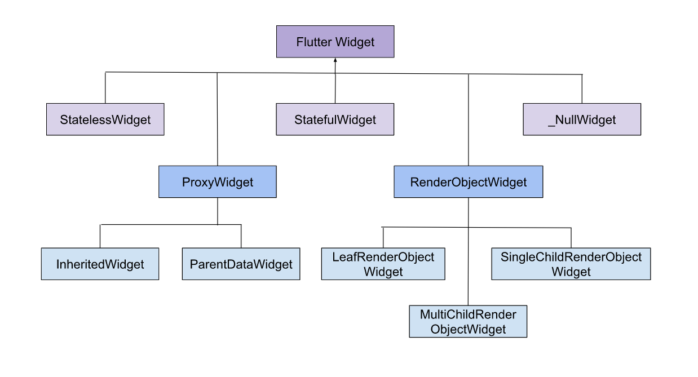
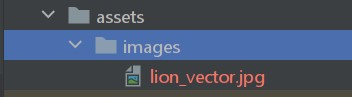
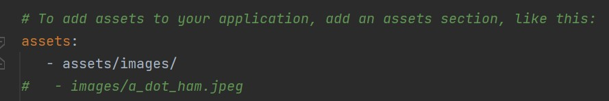

# **My First Flutter App**

Oberve first step is to launch `Android Studio`.
In the Projects section, Click on `New Flutter Project`

```cli
<!-- My Android Studio Version -->
Flamingo | 2022.2.1
```

Now create the project, once every field is filled successfully.


>Note : If you don't find the Flutter project(as shown image), Select the Flutter option from side menus.

`Create` Project

---
This is the project structure.


and this is the demo of what the output looks like. I'm Android phone as a physical device. You can use the virtual device.

The `Lib` folder is the main folder where futter code resides.


---
The `pubspec.yaml` file is the main like as in the Android `build.`gradle` file. Where packages and use assets.

---
**Q. How Flutter works?**

In Flutter, the code starts with `void main()` the void_main() contains all the code and `runApp()` excute the applicate. Insite the runApp(), buttons, text and other widgets.

---

Once you run the code. You don't need to run again-again, use `hot reload`.

```cli
<!-- To Aline the code press -->
Alt + Ctrl + L
```

---

## Widgets

```cli
|--Material App
    |--Scaffold
        |--AppBar
            |--Text
                |--TextSpan
```

>`main.dart`

```dart
import 'package:flutter/material.dart';

void main() {
  runApp(
    MaterialApp(
      title: 'My Flutter App',
      debugShowCheckedModeBanner: false,
      home: Scaffold(
        appBar: AppBar(
          title: Text('DashBoard'.toUpperCase()),
          backgroundColor: Colors.blueGrey,
        ),
        body: const Center(
          child: Text.rich(
            TextSpan(
              text: 'Hello ',
              children: [
                TextSpan(
                  text: 'Saksham ',
                  style: TextStyle(fontSize: 30.0, fontWeight: FontWeight.bold),
                ),
                TextSpan(
                  text: '!',
                  style: TextStyle(fontSize: 10.0),
                ),
              ],
            ),
          ),
        ),
      ),
    ),
  );
}

```

---

## **Organize the Code**

We do not code all things in `main.dart`. Instead, divide into `class` and Directory.

>`main.dart`

```dart
import 'screens/Dashboard.dart';
import 'package:flutter/material.dart';

void main() {
  runApp(
    const MyApp(),
  );
}

class MyApp extends StatelessWidget {
  const MyApp({Key? key}) : super(key: key);

  @override
  Widget build(BuildContext context) {
    return const MaterialApp(
      title: 'My Flutter App',
      themeMode: ThemeMode.system,
      debugShowCheckedModeBanner: false,
      home: Dashboard(),
    );
  }
}

```

Create screen in different Directories.



>`screens/Dashboard.dart`

```dart
import 'package:flutter/material.dart';

class Dashboard extends StatelessWidget {
  const Dashboard({Key? key}) : super(key: key);

  @override
  Widget build(BuildContext context) {
    return Scaffold(
      appBar: AppBar(
        title: Text('DashBoard'.toUpperCase()),
        backgroundColor: Colors.blueGrey,
      ),
      body: const Center(
        child: Text.rich(
          TextSpan(
            text: 'Hello ',
            children: [
              TextSpan(
                text: 'Saksham ',
                style: TextStyle(fontSize: 30.0, fontWeight: FontWeight.bold),
              ),
              TextSpan(
                text: '!',
                style: TextStyle(fontSize: 10.0),
              ),
            ],
          ),
        ),
      ),
    );
  }
}

```

---

## **Add Logic to Application**

In this section, a simple logic is implemented where each time a new `random` number is displayed.

>`screens/Dashboard.dart`

```dart
import 'dart:math';

import 'package:flutter/material.dart';

class Dashboard extends StatelessWidget {
  const Dashboard({Key? key}) : super(key: key);

  @override
  Widget build(BuildContext context) {
    return Scaffold(
      appBar: AppBar(
        title: Text('DashBoard'.toUpperCase()),
        backgroundColor: Colors.blueGrey,
      ),
      body: Center(child: Text("Random Value is : ${getNumber()}")),
    );
  }
}

int getNumber() => Random().nextInt(100);

```

---

## Everything in Flutter is almost a **Widget**

**Q. What Google says about widgets?**

Flutter widgets are built using a modern framework that takes inspiration from React. The central idea is that you `build your UI` out of widgets. Widgets describe what their view should look like given their current configuration and state.

In general Flutter widgets are classified into two categories,

* Stateless Widget
* Stateful Widget

However, you can find more classes in the hierarchy of Flutter [sources](https://github.com/flutter/flutter/blob/master/packages/flutter/lib/src/widgets/framework.dart).



But for simplicity, I have classified it into categories

| Display Widgets | Layout Widgets |
|-----------------|---|
| Text | Center |
| TextSpan | Container |
| Text.rich | Row |
| Image/Icon | Column |
| Button | Table |
| Chip | Stack |
| Badges | Positioned |
| Alerts | Padding/Margin |
| SnakeBar | ListView |
|   | Expanded |
|   | Positioned |

### Explore Core Widgets

* Image/Icon
* Container
* Elevated Button
* AppBar with Icon Button
* Row
* Column
* Expanded
* ListView
* Navigation Drawer
* Floating Action Button
* Stsck
* Positioned

---

## **Add Image**

We have 2 methods for adding images

### **Assets**

Create an `Assets` Directory in the root folder.



and to use the images, need to add the path in `pubspec`.yaml`



and run `Pub get`.

```dart
Image(
  image.AssetsImages('path')
)

<!-- or -->

Image.asset("Path")
```

### **Network**

```dart
Image(
  image.NetworkImages('path')
)

<!-- or -->

Image.Network("Path")
```

The Code for adding Images using Assets

```dart
import 'dart:math';

import 'package:flutter/material.dart';

class Dashboard extends StatelessWidget {
  const Dashboard({Key? key}) : super(key: key);

  @override
  Widget build(BuildContext context) {
    return Scaffold(
      appBar: AppBar(
        title: Text('DashBoard'.toUpperCase()),
        backgroundColor: Colors.blueGrey,
      ),
      body: const Image(
        image: AssetImage('assets/images/lion_vector.jpg'),
        width: 300.0,
        height: 300.0,
        fit: BoxFit.contain,
      ),
    );
  }
}
```

---
