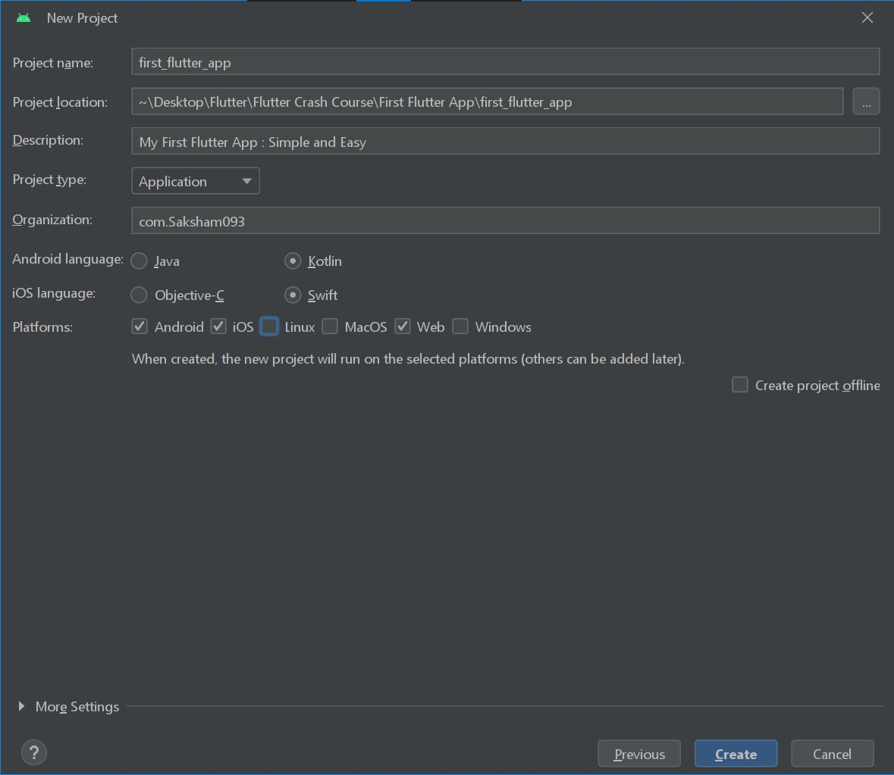
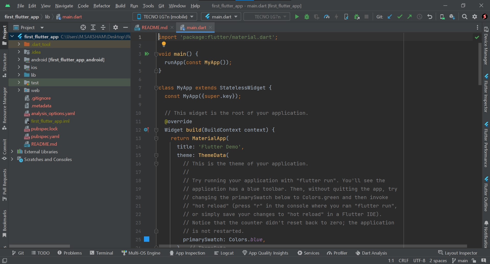
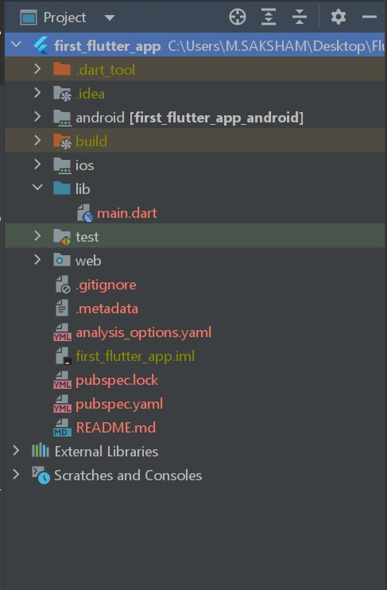

# **My First Flutter App**

Oberve first step is to launch `Android Studio`.
In the Projects section, Click on `New Flutter Project`

```cli
<!-- My Android Studio Version -->
Flamingo | 2022.2.1
```

Now create the project, once every field is filled successfully.



>Note : If you don't find the Flutter project(as shown image), Select the Flutter option from side menus.

`Create` Project

---
This is the project structure.



and this is the demo of what the output looks like. I'm Android phone as a physical device. You can use the virtual device.

The `Lib` folder is the main folder where futter code resides.



---
The `pubspec.yaml` file is the main like as in the Android `build.`gradle` file. Where packages and use assets.

---
**Q. How Flutter works?**

In Flutter, the code starts with `void main()` the void_main() contains all the code and `runApp()` excute the applicate. Insite the runApp(), buttons, text and other widgets.

---

Once you run the code. You don't need to run again-again, use `hot reload`.

```cli
<!-- To Aline the code press -->
Alt + Ctrl + L
```

---

## Widgets

```cli
|--Material App
    |--Scaffold
        |--AppBar
            |--Text
                |--TextSpan
```

```dart
import 'package:flutter/material.dart';

void main() {
  runApp(
    MaterialApp(
      title: 'My Flutter App',
      debugShowCheckedModeBanner: false,
      home: Scaffold(
        appBar: AppBar(
          title: Text('DashBoard'.toUpperCase()),
          backgroundColor: Colors.blueGrey,
        ),
        body: const Center(
          child: Text.rich(
            TextSpan(
              text: 'Hello ',
              children: [
                TextSpan(
                  text: 'Saksham ',
                  style: TextStyle(fontSize: 30.0, fontWeight: FontWeight.bold),
                ),
                TextSpan(
                  text: '!',
                  style: TextStyle(fontSize: 10.0),
                ),
              ],
            ),
          ),
        ),
      ),
    ),
  );
}

```
